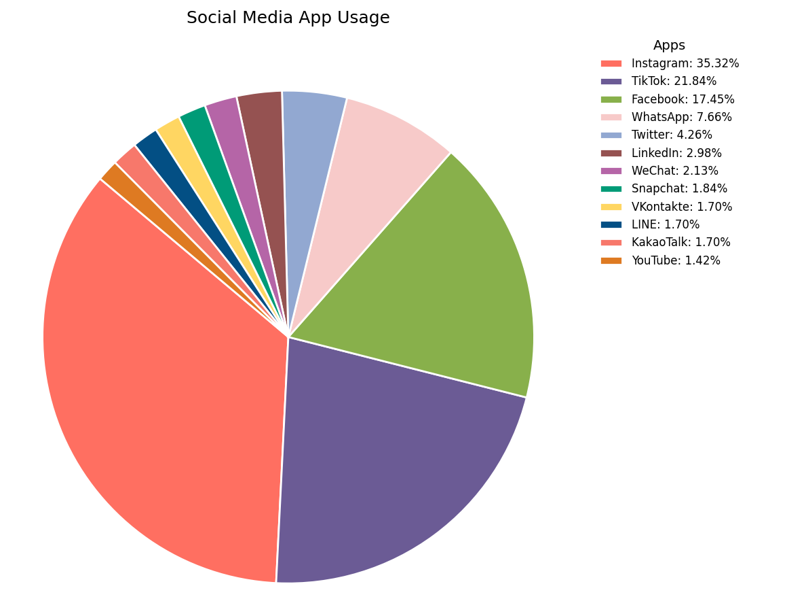

# Social Media Platform Usage Pie Chart

This project visualizes the usage distribution of various social media platforms using a pie chart. The data is sourced from a CSV file (`data.csv`) containing survey responses about the most used social media platforms. The visualization is generated by the `pie_chart.py` script, which reads the data, calculates the percentage usage for each platform, and displays a clean, color-differentiated pie chart with a legend.

## Files

- **pie_chart.py**: Python script to generate the pie chart visualization.
- **data.csv**: Dataset containing the "Most_Used_Platform" column, representing survey responses about social media usage.

## Data Source & Credits

The dataset used in this project is provided by **Adil Shamim** on Kaggle. Adil Shamim is known for sharing insightful datasets related to social trends and behaviors.  
You can find the original dataset and more information in his Kaggle post: https://www.kaggle.com/datasets/adilshamim8/social-media-addiction-vs-relationships

---
## 🙋‍♂️ BHUVANESH M 

🌐 [bhuvaneshm.in](https://bhuvaneshm.in)   
🔗 [linkedin.com/in/bhuvaneshm-developer](https://www.linkedin.com/in/bhuvaneshm-developer)   
✍️ [dev.to/bhuvaneshm\_dev](https://dev.to/bhuvaneshm_dev)   
📊 [kaggle.com/bhuvaneshm06](https://www.kaggle.com/bhuvaneshm06)    

  

 
 <h3 align="center">
    🌌 You are my &nbsp;
    
    &nbsp; visitor. Welcome to my orbit.
</h3>

  

